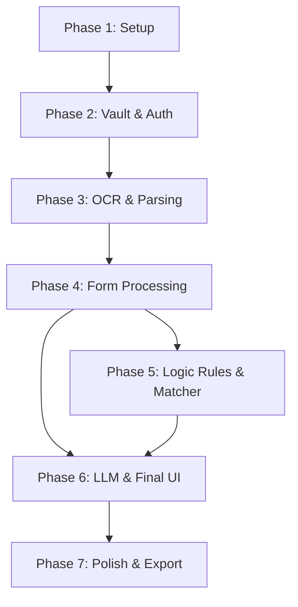

# Implementation Plan: Public Service Form Copilot

**Version:** 1.0
**Date:** September 1, 2026
**Target Architecture:** Spring Boot (Java) Backend + React (Vite) Frontend + SQLite

---

## Table of Contents

1. [Implementation Strategy & Sequence](#1-implementation-strategy--sequence)
2. [Phase 1: Foundation & Project Workspace Setup](#phase-1-foundation--project-workspace-setup)
3. [Phase 2: Database, Security & Vault Management (Backend)](#phase-2-database-security--vault-management-backend)
4. [Phase 3: Document Upload & Basic OCR (Full Stack)](#phase-3-document-upload--basic-ocr-full-stack)
5. [Phase 4: Form Processing & Requirement Extraction](#phase-4-form-processing--requirement-extraction)
6. [Phase 5: Rule Engine & Semantic Matching](#phase-5-rule-engine--semantic-matching)
7. [Phase 6: AI Explanation Engine (RAG) & Checklist UI](#phase-6-ai-explanation-engine-rag--checklist-ui)
8. [Phase 7: Export, Audit Trails & Polish](#phase-7-export-audit-trails--polish)
9. [Deployment & Final QA Checklist](#deployment--final-qa-checklist)

---

## 1. Implementation Strategy & Sequence

The project will be built iteratively. Each phase introduces vertically integrated features (DB -> API -> UI) resulting in a verifiable, working build at the end of each sprint.

### Dependency Graph

---

## Phase 1: Foundation & Project Workspace Setup

**Objective:** Scaffold the monolithic repository containing the Spring Boot Java backend and Vite React frontend. Establish linting, testing frameworks, and continuous integration scripts.

- **Dependencies:** Java 17/21, Node.js 20+, Maven/Gradle.
- **Expected Outcome:** A single repository where running `./mvnw spring-boot:run` serves the Spring Boot API at `:8080` and proxies the frontend (or builds it into `/static`).

### Detailed Tasks
1. **Backend Initialization:**
   - Run Spring Initializr (Web, JPA, SQLite Dialect, Validation, Security).
   - Configure `application.yml` for SQLite local file mode.
   - Setup global exception handling (`@ControllerAdvice`) mapping to standard JSON response bodies.
2. **Frontend Initialization:**
   - Scaffold React + Vite + TypeScript in `./frontend`.
   - Install TailwindCSS and configure `tailwind.config.js`.
   - Setup Axios or Fetch wrappers mapped to `/api/v1`.
3. **Build Integration:**
   - Configure Maven/Gradle to execute `npm run build` in the frontend directory and copy `dist/` to `backend/src/main/resources/static/` upon build processing.

### Definition of Done
- Development server boots up cleanly.
- Navigating to `http://localhost:8080/api/v1/health` returns `200 OK`.
- Navigating to `http://localhost:8080/` serves the default React welcome page.

---

## Phase 2: Database, Security & Vault Management (Backend)

**Objective:** Implement the core local database schemas, local authentication (passphrase to AES key cryptography), and base CRUD structures for Vault Documents.

- **Dependencies:** Phase 1, `java.security` routines.

### Detailed Tasks
1. **Schema Creation (JPA Entities):**
   - Create `VaultDocument`, `Form`, `FormRequirement`, `ChecklistItem`, `AuditLog`.
   - Define Spring Data JPA Repositories for each.
   - Configure Hibernate to `update` or use Flyway/Liquibase to initialize the SQLite schema.
2. **Security & Cryptography:**
   - Implement `CryptoService` to hash a user-provided passphrase with Argon2/PBKDF2 to derive a 256-bit AES key.
   - Keep derived key in an `@SessionScope` bean or memory session store.
   - Write unit tests validating that `encrypt(data)` and `decrypt(data)` are byte-perfect using `AES/GCM/NoPadding`.
3. **Vault API Endpoints:**
   - Implement `GET /vault`, `GET /vault/{id}`, `DELETE /vault/{id}`.
   - Implement `PUT /vault/{id}` to allow metadata correction.

### Definition of Done
- All SQLite tables are automatically created on boot.
- Unit tests verify AES-GCM encryption streams correctly.
- Postman/curl can successfully hit the vault CRUD APIs (simulating metadata payload).

---

## Phase 3: Document Upload & Basic OCR (Full Stack)

**Objective:** Allow users to upload personal documents (Aadhaar, Passport) via the React UI. The backend receives, encrypts, writes the file to disk, runs OCR, and extracts foundational metadata.

- **Dependencies:** Phase 2, Tess4J/Apache PDFBox.

### Detailed Tasks
1. **File Storage & Encryption Stream (Backend):**
   - Implement `POST /vault/upload`. Receive `MultipartFile`.
   - Pipe the `InputStream` directly into `CipherOutputStream` to write an encrypted `.enc` file to `/vault_storage/`.
2. **Basic OCR Integration (Backend):**
   - Wrap Tess4J (`ITesseract`) and Apache PDFBox.
   - Add a Spring `@Async` service `OcrService.extractText(File)` that decrypts the temp file in-memory and runs OCR.
   - Parse basic regex patterns (Dates, "DOB", 12-digit Aadhaar pattern) to auto-fill `VaultDocument` metadata.
3. **UI - Vault Dashboard (Frontend):**
   - Build React components: `VaultDashboard`, `DocumentCard`, `UploadModal`.
   - Allow drag-and-drop file upload.
4. **UI - Image/PDF Preview (Frontend):**
   - Connect `GET /vault/{id}/preview` which decrypts and returns `image/jpeg` or `application/pdf`. Render in React.

### Definition of Done
- A user can drop an image into the UI.
- The image is encrypted on disk.
- OCR extracts basic details (Date of Issue/Expiry).
- User sees the parsed document in their Vault UI.

---

## Phase 4: Form Processing & Requirement Extraction

**Objective:** Enable uploading of blank, official government forms. Parse the form to identify conditions and required documents.

- **Dependencies:** Phase 3.

### Detailed Tasks
1. **Form Upload API (Backend):**
   - Implement `POST /forms/analyze`. Read the blank form file, run OCR if it's an image, or PDF text extraction.
   - Store raw text in `Form` entity.
2. **Requirement Extraction Logic:**
   - (For MVP, assuming deterministic regex/heuristics or a lightweight prompt to local Ollama if already integrated, or pre-canned form templates). Let's implement boilerplate parsing logic for `FormRequirement` (e.g., categorizing "Identity Proof", "Address Proof").
3. **Form Views (Frontend):**
   - Construct `FormsList` and `FormDetail` views.
   - Display a list of `FormRequirement` items to the user to review before generating a checklist.

### Definition of Done
- Uploading a standard PDF form creates a `Form` database entry and `FormRequirement` entries.
- UI displays the structured "What you need" list to the user.

---

## Phase 5: Rule Engine & Semantic Matching

**Objective:** The core logic kernel. Compare the user's encrypted Vault against the Form's Requirements to generate the final statuses (`Available`, `Missing`, `Expired`).

- **Dependencies:** Phase 4, LangChain4j (for matching).

### Detailed Tasks
1. **Semantic Matcher Service:**
   - Embed `documentTypeNeeded` (e.g., "Address Proof") and the user's vault `documentType`s (e.g., "Aadhaar Card", "Utility Bill") using LangChain4j local embeddings (e.g., `ALL-MiniLM-L6-v2` via ONNX).
   - Score similarities. Anything > 0.82 confidence maps the document to the requirement.
2. **Deterministic Rule Engine:**
   - Implement `RuleEvaluatorService`.
   - Process `FormRequirement` validity (e.g., "Valid for 6 months").
   - Compare `VaultDocument.expiryDate` against `LocalDate.now()`.
   - Apply statuses: If document matched but date is expired -> `Expired`. If no match -> `Missing`.
3. **Checklist API:**
   - Implement `POST /checklists/generate`. Create `ChecklistItem` rows for the form.
   - Save rule outcomes to `AuditLog`.

### Definition of Done
- Unit tests verify age eligibility and expiry checks with 100% precision regardless of edge cases (leap years, etc).
- Generating a checklist returns a JSON array correctly mapping Vault documents to Form rules.

---

## Phase 6: AI Explanation Engine (RAG) & Checklist UI

**Objective:** Connect the local Ollama instance via LangChain4j to explain *why* the rules fired, and build the interactive Checklist UI in React.

- **Dependencies:** Phase 5, running Ollama on localhost.

### Detailed Tasks
1. **Ollama Explainer Service (Backend):**
   - Use LangChain4j's `ChatLanguageModel` pointing to `http://localhost:11434`.
   - Implement `POST /checklists/{id}/explain`.
   - RAG Prompt Injection: Provide the LLM with `sourceClause`, `status`, and `matchedDocumentDetails`. Ask for a 2-sentence simple English explanation.
2. **Checklist View (Frontend):**
   - Build an interactive, collapsible checklist component.
   - Show status badges (✅, ❌, ⚠️).
   - Implement an "Explain" button that triggers the LLM API endpoint.
   - Stream or await the response and display the plain-english text.
3. **Graceful Degradation:**
   - If Ollama is off, catch the HTTP Exception, fallback to a deterministic string ("Ollama offline. Rule matched: Date out of bounds").

### Definition of Done
- The UI checklist is fully functional.
- Clicking "Explain" hits the local LLM and accurately summarizes the requirement devoid of bureaucratic jargon.

---

## Phase 7: Export, Audit Trails & Polish

**Objective:** Provide audit transparency for users to trust the system, and allow PDF generation for taking the checklist offline.

- **Dependencies:** Phase 6.

### Detailed Tasks
1. **Audit View (Frontend):**
   - Build a debug/audit panel within the UI item card. Render the original JSON from `AuditLog` mapping rule engine inputs and outputs.
2. **PDF Export Service (Backend):**
   - Implement `GET /checklists/{id}/export`.
   - Use Apache PDFBox or OpenPDF to generate a formatted A4 page looping through checklist items, printing status, document, and rules.
3. **UI Polish & Accessibility:**
   - Ensure WCAG 2.1 AA keyboard support on interactive lists.
   - Optimize Tailwind classes for dark/light mode toggle.

### Definition of Done
- A user can click "Export to PDF", triggering a valid file download.
- QA verifies that no external API calls were captured on a network sniffer tool (Wireshark/Fiddler).

---

## Deployment & Final QA Checklist

**Objective:** Package the monolithic app to run seamlessly as a desktop executable for Windows/Mac end users.

### Detailed Tasks
1. **jpackage bundling:**
   - Create build scripts for Maven/Gradle that utilizes JDK tool `jpackage`.
   - Ensure `jpackage` bundles a JRE alongside the `.jar` + `./vault_storage` schema directories into a `.msi` (Win) or `.dmg` (Mac).
2. **Pre-Flight Health Checks (Backend):**
   - Write a boot event listener that warns the user heavily in the startup logs if Ollama is not installed natively on their OS.

### Final QA Acceptance Checklist
- [ ] No PII exits the localhost interface (validated by Network monitor).
- [ ] Uploaded files are successfully stored and securely AES-encrypted on the disc.
- [ ] Tess4J OCR appropriately parses general text structures from scanned images.
- [ ] Semantic matching maps synonyms correctly ("Proof of Res." -> "Domicile").
- [ ] Deterministic Date rules accurately block expired certificates.
- [ ] Ollama successfully generates plain-english simplifications via LangChain4j.
- [ ] App cleanly boots out-of-the-box (assuming JRE/jpackage is correct) with SQLite initializing itself seamlessly.
