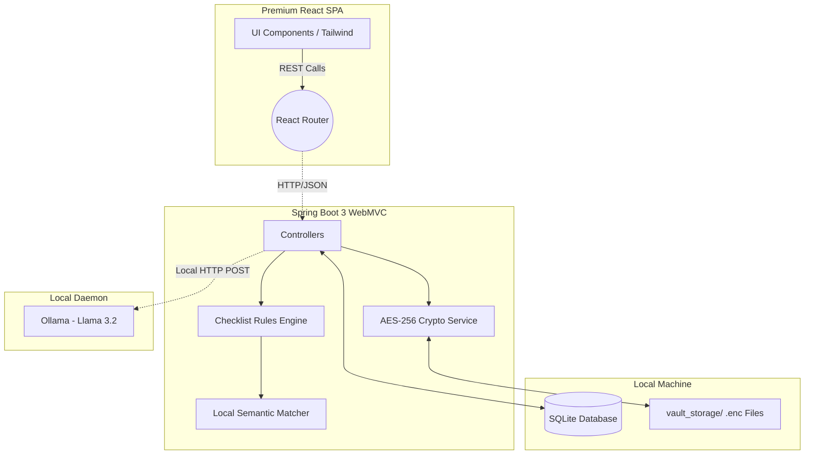

<div align="center">
  <br />
  <h1>🛡️ Public Service Form Copilot</h1>
  <p>
    <strong>A Premium, Privacy-First Document & Application Assistant.</strong><br/>
    Navigate complex bureaucratic forms and personal document management locally and securely, without the cloud.
  </p>

  <p>
    
    
    
    
    
    
  </p>
</div>

<hr />

## 📖 About the Project

**Public Service Form Copilot** solves the tedious problem of manual bureaucratic requirement mapping. It allows users to securely deposit their sensitive identity and financial documents into a local **encrypted vault**, upload official PDF forms for semantic text analysis, and automatically generate readiness checklists entirely offline. 

By employing **Military-grade AES-256** encryption at rest, a **deterministic local rule engine**, and optional **local LLM** integration (via Ollama), the system guarantees absolute sovereignty over your private data. **Zero cloud endpoints. Zero API keys. Total Privacy.**

---

## ✨ Key Features
- **Secure Encrypted Vault:** Uploaded documents are instantly wrapped in AES-256-GCM encryption before writing to the local disk. Cryptographic decryption occurs strictly in-memory on demand.
- **Smart Form Analysis:** Extracts and dissects complex PDF application forms into categorical requirements using Apache PDFBox.
- **Semantic Requirements Matching:** The local engine deterministically maps extracted form requirements to your vaulted documents, applying expiration rules and generating a foolproof readiness checklist.
- **Local AI Explanations:** Encounter confusing legalese (e.g., "Address History Mismatch")? Integrate with local Ollama (`llama3.2`) to receive plain-English tooltips—without your data ever leaving the machine.
- **Premium Glassmorphism UI:** Built with an ultra-premium React 19 interface featuring interactive steppers, layered transparency, smooth Framer-like CSS animations, and highly responsive floating layouts.
- **Zero-Config Modular Monolith:** Packaged intelligently via Maven to serve both the React frontend and Spring Java API from a single monolithic executable JAR.

---

## 🏗️ System Architecture

The application adopts a **Local-First Modular Monolith** architecture. The frontend SPA is bundled into the Spring Boot static resource directory, removing CORS headaches and allowing a single 1-click execution for end users.



### Technology Matrix
*   **UI/UX Platform**: React 19, Vite, TypeScript, Tailwind CSS, Lucide React (Icons).
*   **API Platform**: Java 21, Spring Boot 3.4.1 (Web, JPA, SQLite-JDBC, Hibernate).
*   **Security Context**: BouncyCastle `bcprov-jdk18on` (AES/GCM/NoPadding). No web security/auth protocols are invoked as the target environment is inherently local and single-tenant.
*   **Document Parsing**: Apache PDFBox 3.0.0.

---

## 🚀 Getting Started

### Prerequisites
*   **Java Development Kit (JDK) 21**
*   **Node.js v20+**
*   **Maven** 
*   *(Optional)* **Ollama** installed on port `11434` for AI-simplified explanation features.

### Installation & Build

1. **Clone the repository:**
   ```bash
   git clone https://github.com/Mohak0204/FormCopilot.git
   cd FormCopilot/backend
   ```
2. **Compile the Monolith**
   The `pom.xml` uses the `exec-maven-plugin` to automatically transparently install NPM modules, build the Vite production dist, and package it into the Spring Boot application jar context.
   ```bash
   mvn clean package -DskipTests
   ```
   *(Note: This might take a few minutes as it triggers a full clean React JS build first).*

3. **Run the Application**
   ```bash
   java -jar target/form-copilot-0.0.1-SNAPSHOT.jar
   ```

4. **Access the Application**
   Open your browser and navigate to exactly: **`http://localhost:8080`**

---

## 🔒 Security & Privacy Notice
- **No API Keys**: There are absolutely no cloud vendor API credentials required, stored, or transmitted by this software.
- **Local Persistence Only**: Uploaded documents are committed natively to `form-copilot/vault_storage/` in AES encrypted format. Metadata uses a local SQLite flat-file at the repository root.
- **Demo Key Use**: Currently, the `CryptoService.java` relies on a compiled pseudo-random static configuration byte-array for AES keying to demonstrate MVP functionality without forcing user login sessions. Do not use this MVP as-is for high-stakes enterprise compliance storage without migrating to a User-Derived PBKDF2 Password Key approach.

---

## 📸 Interface Previews

**1. Landing Dashboard** — Premium frosted glass typography and dynamic status metrics.
**2. Document Vault** — Real-time storage overview with inline-decryption previews.
**3. Form Analysis** — Dynamic requirement extrapolation highlighting missing application checkpoints.

---
*Built as a conceptual standard for public service software engineering, striving for seamless beautiful UX without compromising fundamental data privacy.*
