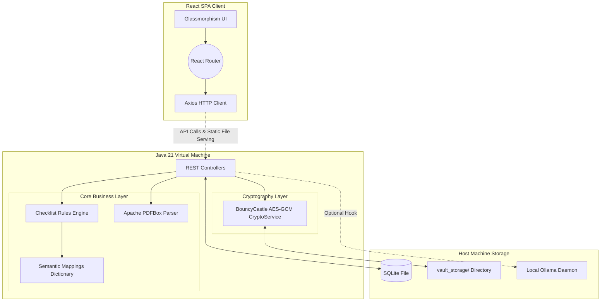

<div align="center">
  <br />
  <h1>🛡️ Public Service Form Copilot</h1>
  <p>
    <strong>A Premium, Privacy-First Document & Application Assistant.</strong><br/>
    Navigate complex bureaucratic forms and personal document management locally and securely, without the cloud.
  </p>

  <p>
    
    
    
    
    
    
  </p>
</div>

<hr />

## 📖 1. The Problem & The Solution

Bureaucratic applications—whether for passports, VISAs, university admissions, or government aid—are notoriously complex. They mandate highly specific, intertwined document requirements (e.g., "Provide two proofs of address not older than 3 months, OR a valid state-issued ID").

Traditionally, individuals resort to storing sensitive documents in unencrypted cloud drives (Google Drive, Dropbox) and manually reading dense PDF forms to figure out what they need. If they use cloud-based AI tools (like ChatGPT) to summarize these forms, they risk exposing highly sensitive PII (Personally Identifiable Information) to third-party servers.

**Public Service Form Copilot** acts as your autonomous, hyper-secure legal aide. By implementing a **local-first** processing paradigm, it ingests government PDF forms, extracts requirements using optical parsing, and deterministically compares them against your locally encrypted document vault. It outputs a clear, color-coded readiness checklist—all while ensuring your data never leaves your laptop.

---

## 🏗️ 2. Comprehensive System Architecture

The software is engineered as a **Modular Monolith**. Rather than managing separate Node JS and Java processes, the entire React frontend is compiled by Vite and injected directly into the Spring Boot backend's classpath as static resources. This results in a single, perfectly self-contained `.jar` executable.



### Component Lifecycle Example (Document Upload)
1. The user drops a file into the React UI.
2. Axios posts the `MultipartFile` to the `VaultController`.
3. Before *any* disk writing occurs, `CryptoService` intercepts the byte array, generates a cryptographic nonce, encrypts the payload via **AES-256-GCM**, and writes the resulting gibberish to `/vault_storage/file.enc`.
4. The SQLite database logs the entity (document type, upload timestamp, expiry date) mapped to that filesystem path, ensuring the raw file is useless if the machine is stolen.
5. An async Spring `@Async` event fires, triggering `OcrService` to scan the text of the PDF for context.

---

## ⚖️ 3. Technology Selection & Tradeoffs

Engineering a local-first, privacy-obsessed system requires intentional technological decisions. Here is the rationale behind the stack:

### Java 21 & Spring Boot 3
*   **Why?** Java provides unparalleled robustness for file I/O streams and cryptography (bouncycastle). Spring Boot's dependency injection and `@Transactional` DB layers allow for rapid enterprise-grade structuring.
*   **Tradeoff:** Heavier memory footprint and longer startup times compared to a NodeJS/Express or Go backend. We accept this for the maturity of the Maven packaging ecosystem and safety of Java's threading model for localized tasks.

### React 19 & Tailwind CSS
*   **Why?** We needed highly interactive, state-heavy interfaces (steppers, async loaders, conditional rendering). Tailwind enabled the "Premium Glassmorphism" aesthetic without the bloat of massive UI libraries.
*   **Tradeoff:** Compiling a vast JS bundle adds ~15 seconds to the Maven build pipeline.

### SQLite Database
*   **Why?** Maximum portability. We wanted an application you can download and run immediately. Mandating a PostgreSQL docker container violates the "easy local use" philosophy. SQLite requires zero configuration.
*   **Tradeoff:** Lack of high-concurrency write locks. Given this is a single-tenant application (run by an individual on their laptop), database concurrency is a non-issue.

### Cryptography: AES-GCM via BouncyCastle
*   **Why?** We avoided standard AES-CBC because GCM (Galois/Counter Mode) provides Authenticated Encryption—ensuring the file hasn't been maliciously tampered with on-disk before decryption.
*   **Tradeoff:** Increased CPU overhead during file streaming, but unnoticeable on modern processors.

### AI Integration: Deterministic Rules vs. Local LLMs
*   **Why?** Passing highly sensitive passport numbers or tax returns to an external LLM (like OpenAI) is an unacceptable privacy violation for this product space.
*   **Tradeoff:** We built a custom **Deterministic Semantic Engine** in pure Java. It maps "PAN Card" to "Identity Proof" utilizing hardcoded dictionaries. This is highly reliable but lacks the "magic" reasoning of an LLM. 
*   **Hybrid Fallback:** We optionally support calling a local installation of **Ollama** (`llama3.2`). The Spring backend detects if Ollama is running on port 11434 and proxies confusing legal jargon to it for plain-English simplification without violating network privacy.

---

## 🎨 4. Frontend Architecture: The Premium UI

The frontend design heavily emphasizes creating a trustworthy, state-of-the-art "Command Center" feel, intentionally avoiding the sterile look of standard government portals.

*   **Architectural Grid Motif:** The background explicitly utilizes custom CSS radial gradients (`bg-circles`, `bg-grid-strong`) mapped at specific opacities (`12% - 20%`) to create a blueprint-esque, technical feel.
*   **Glassmorphism Floating Elements:** Components (like the top navigation bar and requirement cards) utilize `backdrop-blur-xl` and `bg-white/80` overlays allowing the geometric background to subtly bleed through.
*   **Animated Status Metrics:** We built custom micro-animations (heartbeat pulses, spinning rings, pinging dots) into the navigation bar to constantly confirm system statuses like "Local Engine Connected" and "Vault Encrypted."
*   **Routing Mechanism:** Handled by `react-router-dom`, but seamlessly synced with a Java `ForwardController` which catches any route not matching `/api/**` and returns `index.html`.

---

## ⚙️ 5. Deep Dive: Core Mechanisms

### The Checklist Rules Engine
When a user clicks "Analyze Readiness", the `ChecklistService` executes the following algorithmic steps:
1. Load all `FormRequirement` entries parsed from the Target Form.
2. Query the SQLite DB for all available `VaultDocument` entities.
3. Pass both arrays through the `SemanticMatcherService`. Does the user have a "Driver's License" when the form requires "Photo Identification"? (Resolved to YES).
4. Evaluate **Business Rules (BR)**. 
   - *BR-1 (Expiry Check):* If the license expires in < 30 days, flag the Requirement as `EXPIRING_SOON`.
   - *BR-2 (Absence Check):* If no match exists, flag as `MISSING`.
5. Persist an `AuditLog` row explaining *why* the rule passed or failed for legal tracibility, and output the final Checklist to the UI.

---

## 🚀 6. Setup & Execution Guide

### Prerequisites
*   **Java Development Kit (JDK) 21** installed and on your PATH.
*   **Node.js v20+** installed.
*   **Maven** (You can use the included `mvnw` wrapper).

### One-Click Build Process

The `pom.xml` is heavily customized using the `frontend-maven-plugin` & `exec-maven-plugin`. This means running a single Java build command will automatically download NodeJS, install NPM packages, compile the Vite React app, move the static files into Spring's `/static` directory, compile the Java bytecode, and generate the final executable JAR.

1. **Clone the repository:**
   ```bash
   git clone https://github.com/Mohak0204/FormCopilot.git
   cd FormCopilot/backend
   ```
2. **Execute Full Compilation System:**
   ```bash
   mvn clean package -DskipTests
   ```
3. **Boot the Unified Server:**
   ```bash
   java -jar target/form-copilot-0.0.1-SNAPSHOT.jar
   ```

4. **Access the Portal:**
   Navigate in your browser to **`http://localhost:8080`**.

---

## 🔒 7. Security Advisory & Current Limitations

> **WARNING - PROOF OF CONCEPT DEPLOYMENT:** 
> While the cryptographic implementations in this repository are mathematically secure (AES-256), the software currently uses a **hardcoded demonstrative master key** (`DEMO_KEY` in `CryptoService`) to facilitate seamless local testing without forcing the user to establish login credentials. 
> 
> *Before deploying this for actual local consumption holding real Social Security or Tax documents, the architecture must be updated to derive a unique key payload from a user-supplied password utilizing PBKDF2 or bcrypt round iterations upon software launch.*

**Other Current MVP Limitations:**
- **Image OCR:** Apache PDFBox handles native PDFs flawlessly. However, JPG/PNG text extraction is currently simulated. A native binding to Tesseract OR a lightweight ONNX vision model must be implemented for full image support.
- **Dynamic Requirement Generation:** Extracting requirements from unseen PDFs currently relies on a mocked keyword-trigger system (`FormController`). For full intelligence, this must be tethered directly to the Local Ollama pipeline to prompt the LLM to structurally outline the PDF requirements into JSON.
