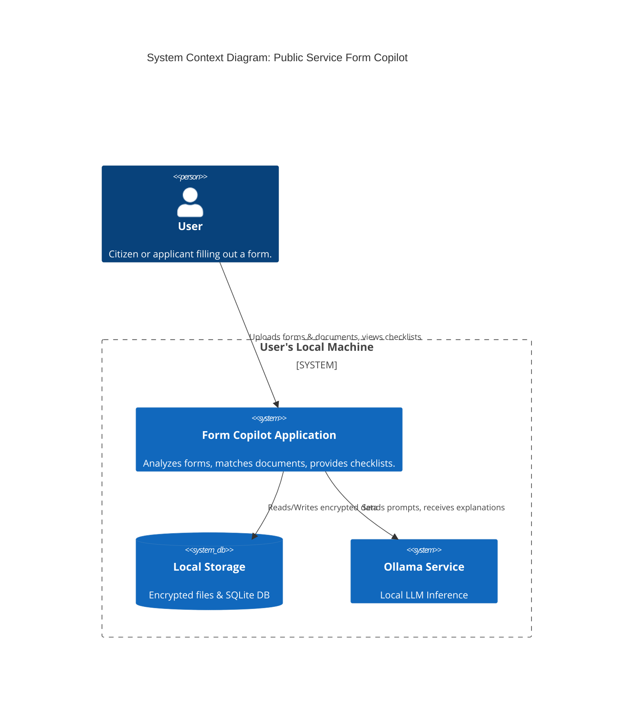
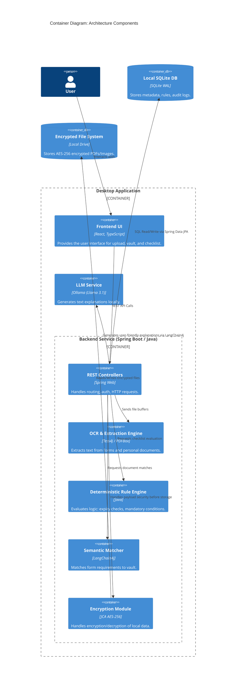
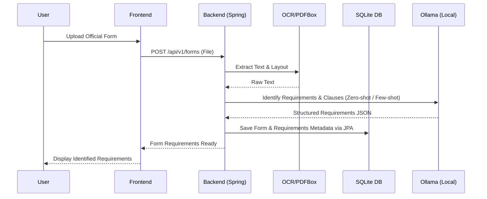
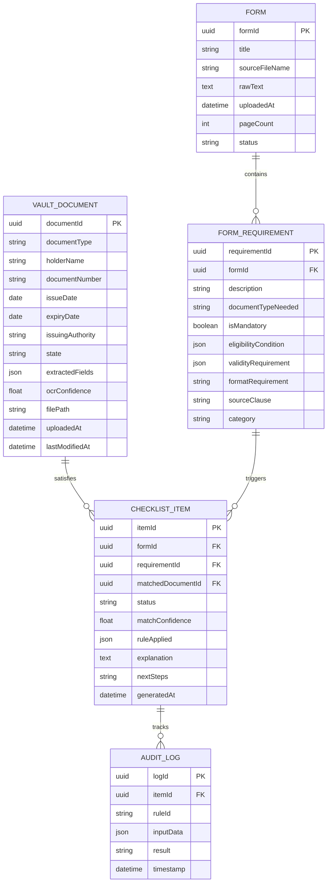

# System Architecture Document: Public Service Form Copilot

**Version:** 1.0
**Date:** September 1, 2026
**Status:** Implementation-Ready

---

## Table of Contents

1. [Architecture Overview & Architectural Style](#1-architecture-overview--architectural-style)
2. [Recommended Technology Stack & Rationale](#2-recommended-technology-stack--rationale)
3. [System Context & High-Level Architecture](#3-system-context--high-level-architecture)
4. [Component & Data-Flow Diagrams](#4-component--data-flow-diagrams)
5. [Frontend Architecture](#5-frontend-architecture)
6. [Backend Architecture](#6-backend-architecture)
7. [Major Components, Modules, and Responsibilities](#7-major-components-modules-and-responsibilities)
8. [Database Architecture & Schema](#8-database-architecture--schema)
9. [File & Storage Handling](#9-file--storage-handling)
10. [API Design & Documentation](#10-api-design--documentation)
11. [Authentication, Authorization & Security](#11-authentication-authorization--security)
12. [Validation & Error Handling](#12-validation--error-handling)
13. [Logging, Monitoring, and Performance](#13-logging-monitoring-and-performance)
14. [External Services & Integrations](#14-external-services--integrations)
15. [Testing Strategy](#15-testing-strategy)
16. [Deployment & Infrastructure Architecture](#16-deployment--infrastructure-architecture)
17. [Recommended Project Structure](#17-recommended-project-structure)
18. [Key Architectural Decisions, Trade-offs & Risks](#18-key-architectural-decisions-trade-offs--risks)

---

## 1. Architecture Overview & Architectural Style

The application follows a **Local-First, Embedded Client-Server Architecture**. Because of strict privacy constraints (zero external transmission of PII) and the need to run local machine learning models, the software will operate as a standalone desktop application. 

The system relies on a **Modular Monolith** style for the backend server running locally on the user's machine, accessed through a local web-based user interface. This pattern balances ease of development with clean separation of concerns, providing all offline capabilities, local data processing, and LLM inferences via local software stacks.

---

## 2. Recommended Technology Stack & Rationale

| Component | Technology | Rationale |
|-----------|------------|-----------|
| **Frontend UI** | React.js (Vite, TypeScript), TailwindCSS | Fast rendering, modular components, wide ecosystem. Tailwind allows for quick styling. |
| **Backend API** | Java (Spring Boot) | Spring Boot provides a robust, enterprise-grade framework for the API, dependency injection, and orchestrating local processing modules. |
| **Database** | SQLite (WAL mode) | Embedded, zero-configuration local database. WAL (Write-Ahead Logging) enables highly concurrent read/writes and crash resilience. |
| **ORM** | Hibernate / Spring Data JPA | Standard Java ORM for type-safe database interactions and rapid repository development. |
| **Document Processing** | Apache PDFBox, Tess4J (Tesseract Java wrapper) | Fast text/layout extraction. Open-source standard for local OCR. |
| **Local LLM & AI Integration** | LangChain4j + Ollama | LangChain4j easily bridges Java applications with local Ollama models (Llama 3.1 / Mistral). |
| **Embeddings/Search** | LangChain4j Local Embeddings | In-memory or local embedding stores for semantic search vector matching. |
| **Encryption** | Java Cryptography Architecture (JCA, AES-256-GCM) | Robust, local AES-256 encryption using standard Java libraries. |
| **Desktop Orchestration** | jpackage / Electron | Spring Boot backend can be packaged as a standalone executable via `jpackage`, or paired with Electron wrapping the React UI as a seamless desktop application. |

---

## 3. System Context & High-Level Architecture

The system is entirely contained within the User's Local Machine.



---

## 4. Component & Data-Flow Diagrams



### 4.1 Form Processing Data Flow



---

## 5. Frontend Architecture

The frontend will be built as a Single Page Application (SPA).

- **Framework:** React with Vite.
- **State Management:** React Context or Zustand for global state (Auth status, active form).
- **Styling:** TailwindCSS for utility-first styling.
- **Routing:** React Router.
- **Key Views:**
  1. **Dashboard:** Overview of recent checklists.
  2. **Vault View:** Grid/List of personal documents, status, expiry.
  3. **Form Upload:** Drag-and-drop zone.
  4. **Checklist View:** Interactive checklist with expandable "Explain" sections, side-by-side context views.

---

## 6. Backend Architecture

The backend is built around building reliable data pipelines for document ingestion and evaluation.

- **Framework:** Spring Boot.
- **Core Pattern:** 3-Tier Architecture Pattern (Controllers -> Services -> Repositories via Spring Data JPA). This abstracts database logic away from business logic.
- **Data Protection:** All file streams are encrypted in memory *before* being written to the disk.
- **Asynchronous Execution:** Heavy tasks (OCR, Embeddings) are run asynchronously using Spring's `@Async` and an internal `TaskExecutor` thread pool so UI polling requests aren't blocked.

---

## 7. Major Components, Modules, and Responsibilities

1. **Ingestion Engine (OCR & Extractor):**
   - Differentiates between text-PDFs and image-PDFs/images.
   - Extracts date formats, named entities, and physical layouts using PDFBox and Tess4J.
2. **Deterministic Rule Engine (The Core Validator):**
   - Bypasses the LLM completely for factual status evaluation.
   - Applies JSON/YAML defined rules against target documents.
   - Returns logical states: `Expired`, `Missing`, `Expiring Soon`, `Available`.
3. **Semantic Matcher:**
   - Embeds form clauses and user document definitions using LangChain4j.
   - Uses cosine similarity to map "Address Verification" to "Aadhaar" or "Utility Bill".
4. **Explanation Generator (RAG Module):**
   - Feeds the evaluation result, the original clause, and the user's document metadata to the local LLM in a rigid prompt context.
5. **Security Manager:**
   - Derives a symmetric master key from the user's login passphrase using PBKDF2 or Argon2 (via Spring Security Crypto/BouncyCastle).
   - Intercepts all file writes via streams to apply AES-256 encryption.

---

## 8. Database Architecture & Schema

### ER Diagram



---

## 9. File & Storage Handling

- **Database:** Stored as `copilot_local.db` in the OS-specific application data directory (e.g., `%APPDATA%/FormCopilot/` or `~/.config/form-copilot/`).
- **Files:** The raw user documents (Aadhaar, PDF files) are stored in an adjacent `/vault_storage/` directory.
- **Encryption Process:**
  - Files are NEVER touching disk unencrypted.
  - The backend receives the memory `InputStream`.
  - AES-GCM encryption is applied on the fly using `CipherOutputStream`.
  - The cipher text is written to disk.
  - Decryption happens via `CipherInputStream` into memory when returning to the frontend for preview.

---

## 10. API Design & Documentation

Standard RESTful API via Spring Web. Documented automatically via Springdoc OpenAPI (Swagger UI) at `http://localhost:8080/swagger-ui.html`.

### **Auth & Session**
- `POST /api/v1/auth/login` : Start session, generate derived encryption key in memory.
- `POST /api/v1/auth/logout`: Destroy key in memory, end session.

### **Vault Endpoints**
- `GET /api/v1/vault` : List metadata for all documents.
- `POST /api/v1/vault/upload` (multipart/form-data) : Upload new doc, returns background task ID for OCR.
- `GET /api/v1/vault/{id}/preview` : Returns decrypted image/PDF buffer.
- `PUT /api/v1/vault/{id}` : Update specific extracted metadata.
- `DELETE /api/v1/vault/{id}` : Secure wipe from DB and file system.

### **Form Endpoints**
- `POST /api/v1/forms/analyze` (multipart/form-data) : Upload form, start extraction and return formId.
- `GET /api/v1/forms/{id}/requirements` : Get structured extraction.

### **Checklist Endpoints**
- `POST /api/v1/checklists/generate` 
  - Input: `{ formId: "uuid" }`
  - Runs Rule Engine + Semantic matching.
- `POST /api/v1/checklists/{id}/explain` 
  - Kicks off local LLM interpretation for a specific item (avoids blocking the whole checklist).
- `GET /api/v1/checklists/{id}/export` : Streams PDF exported checklist.

---

## 11. Authentication, Authorization & Security

- **Authentication System:** Local passphrase only (MVP).
- **Key Derivation:** The user's passphrase is run through Argon2 (or BCrypt depending on library config via BouncyCastle) with a locally stored salt to derive a 256-bit AES key.
- **Session:** Bearer JWT tokens with a 30-minute expiry (auto-refresh on activity) configured via Spring Security.
- **Memory Security:** The encryption key is kept in application memory and wiped on logout or application exit.

---

## 12. Validation & Error Handling

- **Validation:** All incoming payloads are validated strictly by Java Bean Validation (`@Valid`, Hibernate Validator).
- **Global Error Handling:** `@ControllerAdvice` maps exceptions to standard HTTP codes (400 Bad Request, 401 Unauthorized, 404 Not Found) with unified JSON error bodies.
- **Graceful Failures:** If OCR fails, a 206 Partial Content or structured warning is returned, allowing manual data entry.
- **Rule Engine Failures:** If dates are missing, fallback state goes to `"needs_review"` rather than causing a system panic.

---

## 13. Logging, Monitoring, and Performance

- **Logging:** Application uses SLF4J and Logback to write to a local `copilot.log` file with rolling file appenders. Application logs will explicitly mask or not print any PII.
- **Performance:** 
  - **OCR:** Can take 10+ seconds for large PDFs. Handled asynchronously via Spring's `@Async`.
  - **Ollama Inferences:** Can be visually slow. Frontend will use Server-Sent Events (SSE) or WebSockets to stream the textual explanation generated by Ollama API calls.

---

## 14. External Services & Integrations

- **MVP:** **None.** Total air-gap capability.
- **Future:** DigiLocker API integration (v2.0).

---

## 15. Testing Strategy

1. **Unit Tests (JUnit 5 & Mockito):** 
   - Rule Engine (100% coverage mandatory for deterministic rules). Ensure expiry logic accurately handles edge cases like leap years.
   - DTO validations.
2. **Integration Tests (Spring Boot Test):**
   - `@DataJpaTest` for SQLite CRUD operations, ensuring foreign key cascades work.
   - Encryption/Decryption round trip checks.
3. **Mocked ML Tests:**
   - Mock Ollama outputs (via HTTP mocking like WireMock), mock OCR buffers to ensure the pipeline proceeds successfully.
4. **End-to-End (E2E) Tests:** Playwright/Cypress for testing the React UI flows interacting with the running Spring wrapper.

---

## 16. Deployment & Infrastructure Architecture

The deployment is an executable package installed on the user's machine.

1. **Local Binary:** The Java application is built into a single executable JAR (including embedded Tomcat) and packaged using native tools like `jpackage` (which embeds the JVM so users don't need Java installed).
2. **Frontend:** React application is built via Vite into static files, copied into `src/main/resources/static` so Spring Boot serves the UI directly on `localhost`.
3. **Desktop Wrap (Optional):** An Electron or Tauri container could wrap the local web server to give it a native window feel.
4. **Ollama Dependency:** Users must have standard Ollama installed manually (the app will check for port 11434 on startup and prompt the user if Ollama is unreachable via health check logs).

---

## 17. Recommended Project Structure

```text
form-copilot/
├── frontend/                     # React UI (Vite)
│   ├── src/
│   │   ├── components/
│   │   ├── pages/
│   │   ├── services/
│   │   └── store/
│   └── package.json
├── backend/                      # Java Spring Boot API (Maven/Gradle)
│   ├── src/
│   │   ├── main/
│   │   │   ├── java/com/copilot/
│   │   │   │   ├── controllers/  # REST APIs
│   │   │   │   ├── services/     # Business logic, Crypto, AI orchestration
│   │   │   │   ├── engine/       # OCR, Matcher, Rules
│   │   │   │   ├── models/       # JPA Entities & DTOs
│   │   │   │   ├── config/       # Spring Security, Async config
│   │   │   │   ├── repositories/ # Spring Data JPA Interfaces
│   │   │   │   └── Application.java
│   │   │   └── resources/
│   │   │       ├── application.yml
│   │   │       └── static/       # Compiled React frontend drops here
│   │   └── test/                 # JUnit5 specs
│   └── pom.xml                   # Or build.gradle
```

---

## 18. Key Architectural Decisions, Trade-offs & Risks

1. **Decision: Local Monolith via Spring Boot + React**
   - *Rationale:* Ensures privacy and gives a robust framework for complex backend logic.
   - *Trade-off:* Relies heavily on the user's hardware. Processing speed will be dictated by the user's CPU/GPU capabilities. JVM startup time is non-trivial but mitigated by running continuously in the background during use.
2. **Decision: Deterministic rules over LLM-agents**
   - *Rationale:* LLMs hallucinate factual checks (e.g., expiry dates).
   - *Trade-off:* Requires maintaining a hard-coded mapping of document rules in code/JSON, increasing maintenance.
3. **Decision: Ollama requirement**
   - *Rationale:* Best local ecosystem for managing model weights.
   - *Trade-off:* Installation friction. We can mitigate this by checking if Ollama is installed on app boot and directing the user appropriately. 
4. **Risk: OCR Quality on Indian Documents via Tess4J**
   - *Mitigation:* The system UI must prominently feature a "Correct Extraction" button. Relying on perfect OCR is a faulty assumption.
5. **Risk: Encryption Key Loss**
   - *Mitigation:* Because keys are derived from passphrases, a forgotten passphrase means permanent loss of the vault. We must enforce the user downloading a "Recovery Key" on first boot.
